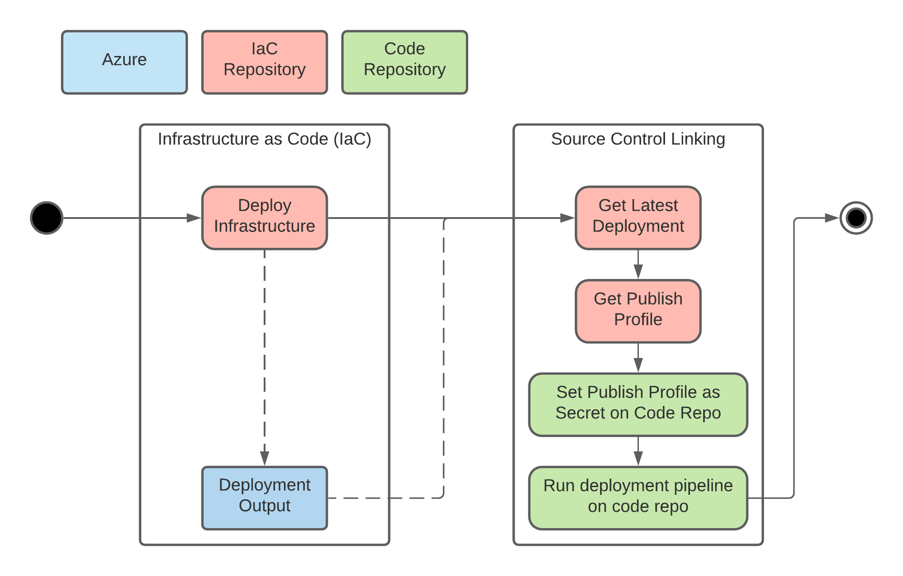

IaC helps with deploying the resources and configuring them. Certain resources, however, need to further be linked to source control e.g. A function app runs code that could be hosted in source control. This page describes a process to automate source control linking from an IaC pipeline


  * [Overview](#overview)
  * [Process](#process)
  * [Naming standards](#naming-standards)

## Overview

## Process

1. Deploy Infrastructure as Code via Bicep


    1. Include an output with source control details (i.e. repository URL and Azure Resource ID pairs)


    
1. Link deployed infrastructure to code


    1. Get the last deployment from Azure


    1. For each repo/resource pair do the following:


    1. Get publishing profile for resource


    1. Save publishing profile as secret on code repo


    1. Run code deployment pipeline on code repo


    

    


## Naming standards
For this process to work in an automated manner there are certain naming standards that have to be maintained


|  **Name**  |  **Template**  |  **Example**  |  **Description**  | 
|  --- |  --- |  --- |  --- | 
| Publishing Profile Secret Name | AZURE_PUBLISH_PROFILE_<ENVIRONMENT> | AZURE_PUBLISH_PROFILE_DEV | The name of the publishing profile which would be stored as a secret on the code repository. This will be branch/environment specific. | 
| Code deploymenent github workflow name | cd_<environment>.yml | cd_dev.yml | The name of the code deployment workflow (via github actions). This would be branch/environment specific. | 
| Git properties deployment output (gitProperties) | 
```json
{
    "gitProperties": [
        {
            "resourceId": "",
            "repoUrl": ""
        }
    ]
}
```
 | 
```json
{
    "gitProperties": [
        {
            "resourceId": "/subscriptions/<subscription-id>/resourceGroups/wt-rg-user-dev/providers/Microsoft.Web/sites/wt-func-user-dal-dev",
            "repoUrl": "https://github.com/wetility-energy/wetility-func-user-dal"
        }
    ]
}
```
 | An output of IaC deployment which would have the pairing between resources and repositories that host the code for that resource. | 


*****

[[category.storage-team]] 
[[category.confluence]] 
