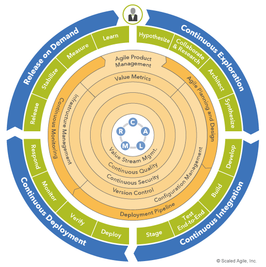

|  **Stage**  |  **Comments**  | 
|  --- |  --- | 
| Continuous Exploration | Exploring new ideas and continuously improve and plan for the next stages. | 
| Continuous Integration | Ensuring quality within the development phase using testing | 
| Continuous Deployment | Automated deployment and monitoring | 
| Release on Demand | Ability to have a smooth process to deploy to live environment and also measure and monitor usage in the real world | 

## References

* [https://www.scaledagileframework.com/devops/](https://www.scaledagileframework.com/devops/)

*****

[[category.storage-team]] 
[[category.confluence]] 
