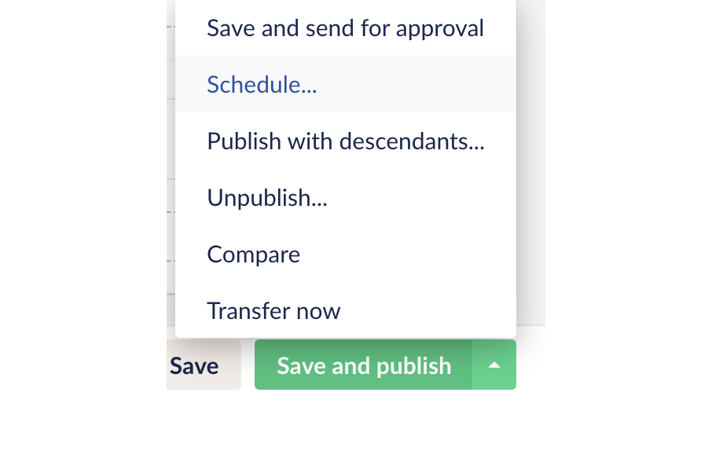

* [Configure smart mode settings via the CMS](#configure-smart-mode-settings-via-the-cms)

# Configure smart mode settings via the CMS
The CMS exits for Dev and for Live and separate instances (the CMS instances map to QA and Production respectively). It is recommended that changes are first made in the Dev CMS and once one is happy with the changes, they can be made again in production. This is as opposed to migrating the changes from Dev to Live, as it is possible to also migrate other testing data which may affect users using the live system.

1. Sign in to the CMS backoffice(Dev -[https://dev-mangrove.euwest01.umbraco.io/](https://dev-mangrove.euwest01.umbraco.io/)   or Live - [https://mangrove.euwest01.umbraco.io/](https://mangrove.euwest01.umbraco.io/)  depending on the objective)

1. On the side menu under “Content” click “Smart Mode Engine”

1. Use the slider to select an SOC value which our smart engine will apply to all pace devices which have smart mode enabled.  

1. Click on “Save and Publish” to immediately make the new smart mode setting available to the rest of the system (particularly the device api)

    

    1. Click “Save” if you only wish to save a draft version but aren’t ready to release the changes

    1. Under the up arrow on the “Save and publish” button, you can access an extra menu with the “Schedule” button if you want to schedule the publishing of your changes to a later time.

    

Your changes are now available in the environment you are currently on. Our Smart Mode Engine will use your configured settings the next time it executes.

*****

[[category.storage-team]] 
[[category.confluence]] 
