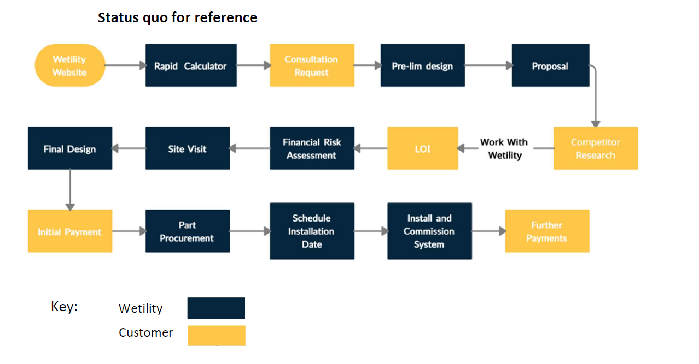

## Date

## Participants
List meeting participants using their @mention names:

* 

* 

* 

* Wetility Team

## Goals

* Industry Phrases Jargon

    * PACE (Actual device)

    * SEMS (Device data)

    * We-X

    
* Data strategy

    * Device Data / SEMS

    * Proxy vs Stage

    * Digital Twin vs Custom

    * Retrieve vs Calculate or Infer?

    
    * Zendesk

    *  **Demo on current setup (i.e. what features and add-ons are on the current setup)** 

    
    * Identity (B2C vs Employees)

    * Demographic Data?

    
    * Monitoring/Metrics

    * Custom metrics or use system (e.g. rely on Zendesk for customer related metrics)

    
    * Surveys

    * QR Code survey: Why?

    

    
* API

    * List of API services (discuss consumers of API)

    
* Front End

    * Web only or Web and App (Recommend app for existing users - brand loyalty, Web for incoming users)

    
* Auto notifier

    * Recipient channel fornotifications?

    

## Discussion topics

| Time | Item | Presenter | Notes | 
|  --- |  --- |  --- |  --- | 
|  | Jargon / Phrases |  | <ul><li>PACE

<ul><li>HW

</li></ul></li><li>SEMS

<ul><li>User Portal - GoodWe (manufactures inverter) - with Smart Energy Data

</li><li>RAW data against device - API provided by GoodWe

</li></ul></li><li>We-X (main customer portal)

<ul><li>Portal with all the data

</li></ul></li></ul> | 
|  | As-Is Process and Technology |  |  | 
|  | Zendesk Setup |  | Confirm integrations and CRM setup currently. Show similar setup on Jira ITSM | 

1001820262561823539811wetility_ca_process_as-is.drawio44https://palota.atlassian.net/wikiUntitled Diagram.drawio010511051
## Action items
Add action items to close the loop on open questions or discussion topics:

3incomplete
## Decisions
Type /decision to record the decisions you make in this meeting:

c3f22e03-8608-40d7-b1cc-118b15390197DECIDEDc30804f1-6343-45f6-878e-7488fb0dec40

*****

[[category.storage-team]] 
[[category.confluence]] 
