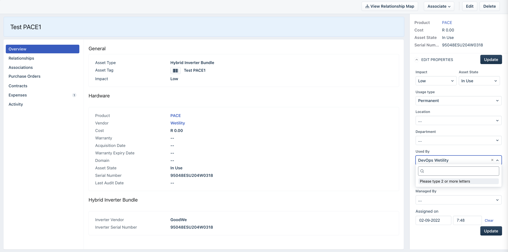

# User Accounts

|  **System**  |  **Main Identifier**  |  **Description**  | 
|  --- |  --- |  --- | 
| Azure AD B2C | User ID | This is the main user account that a customer interacts with. From this level, the user can sign in with their own email/password or use a social identity provider. | 
| Freshservice | Requester ID | Tickets on Freshservice are assigned to requesters. Requesters are the user objects representing the actual customer. | 
| Freshsales | Contact ID | Deals on Freshsales are assigned to contacts. Contacts represent both leads and customers who have went past the lead stage. | 

## User Account Relationships
Below is an overview of how the three different accounts are related.

1002531983372533949561user-account-relationships.drawio11https://palota.atlassian.net/wikiuser-account-relationships.drawio0481.00000000000006241.00000000000003noteThe Azure Database Record shown above is the main unifying record that has identifiers of all three systems in one place. For that record to exist the linking needs to happen.

The Azure Database Record shown above is the main unifying record that has identifiers of all three systems in one place. For that record to exist the linking needs to happen.

# Freshworks Linking

## Freshsales to Freshservice
Within the Freshworks product suite, there is also account linking that works on the primary email level.

1002531983372532311541freshworks-linking.drawio11https://palota.atlassian.net/wikifreshworks-linking.drawio0231.00000000000006361.00000000000006
## Freshservice asset linking
The asset module in Freshservice is used to link the PACE devices to customers (requesters).

Freshservice contains multiple asset types. It is important to use the correct asset type (“Hybrid Inverter Bundle”) for the PACE devices. The asset type requires the serial number. It is important that the correct serial number is used both for the asset serial number and inverter serial number (which for now is the same value, but may be different in future).

The assets do not have to be loaded when they need to be linked to customers, they can be loaded without requesters linked. This would represent the in-stock inventory.

### Adding an Asset

1. Sign in to Freshservice as a user with the appropriate rights to create assets.

1. Start the journey by clicking on “Create Asset”, e.g. via the blue button on the top app bar on Freshservice.

1. In the upcoming screen, add a display name for the asset and select “Hybrid Inverter Bundle” as the asset type.

    

1. In the “Hardware Properties” section select “PACE” as the product and “Wetility” as the Vendor.

1. Enter the Serial Number and the appropriate Asset State. E.g. In Stock or In Use

1. Under “Hybrid Inverter Bundle Properties” enter the Inverter Serial Number (which should be the same as the main serial number), as well as the inverter vendor (e.g. GoodWe).

1. Under “Assignment”, use the “Used By” field to select the requester that has this asset assigned to them. N.B. This is optional, as you can load assets as a pre-step before assigning. Assignment can happen at a later stage.

### Linking an existing asset (or changing users)

1. Sign in to Freshservice as a user with the appropriate rights to create assets.

1. Go to the “Inventory” page under “Assets” from the main menu.

1. Select the asset you wish to update from the list and open it.

1. Once opened, from the side menu on the right, you can change the “Used by” field to change the assignment or fully remove the assignment.

# Account Activation
The end-users have the flexibility to use their own type of sign-in method, including social identity providers. This means there is naturally a disconnect between what is in Freshworks and the user’s sign-in account. For the user to see information from Freshworks (particularly their installed assets/devices from Freshservice), there needs to be a link created from Azure to Freshworks. Since we don’t know the credentials the end-user uses (and shouldn’t know them), the end-user needs to drive that linking process (or at least trigger it)

The process to do the activation is as follows:

1. The user should be sent an activation link. This link should include the Freshservice requester ID. The link will allow the user to log in and whatever credentials they logged in with will be linked to the fresh service requester specified in the link. As an example, this can be done as an automated post-installation step from Freshservice. This can be sent as an email to the Freshservice Email with an explanation.

1. Once the user received the link they can click the link and once they do the following will happen:

    1. Sign-in/up experience will be shown on whatever platform they clicked the link on (i.e. From desktop or mobile)

    1. If the user had not signed up before, they can sign up at that stage. Alternatively, they can just sign in.

    1. After signing in. In the background the following steps will happen:

    1. Requester details will be retrieved from Freshservice

    1. Primary Freshservice email from requester details will be used to retrieve Freshsales Contact details

    1. A list of all assets from Freshservice assigned to that requester will be retrieved

    1. The Azure database record will be updated with a consolidated user record with all identifiers (Azure User ID, Freshservice Requester ID, Freshsales Contact ID)

    1. The Azure database device record will be updated with a list of all devices assigned to the user (so that the the user is using the app, the data can be retrieved from Azure, and not form Freshservice every time)

    
    1. Once the background steps have been completed. The sign-in experience will show a success message indicating to the user that their account has been activated.

    
1. After exiting this journey the user can use the same credentials on the app. But now the app would show whatever devices they had linked.

## Asset Sync
Asset Assignment details may change after activation. E.g., a user may later get a second PACE device. In there is a workflow in Freshservice that listens to changes on assets, and if there are changes it will update Azure. In this case the user would not have to be directly involved as there would already been an Azure record that links the different identifiers together.

As an example if a new asset is added to a already activated user, the below process will unfold.

1002531983372534278331asset_sync_existing_user_new_device.drawio11https://palota.atlassian.net/wikiasset_sync_existing_user_new_device.drawio0480.9999999999999811

## Account Activation Link

Below is the production activation Link for Freshservice Requester Id 123:

https://wetilityconsumer.b2clogin.com/wetilityconsumer.onmicrosoft.com/oauth2/v2.0/authorize?p=B2C_1A_ACCOUNTLINK_SUSI_LINKFRESHSERVICE&client_id=47e5b691-2534-4789-83ac-9edbd1404566&nonce=defaultNonce&redirect_uri=https%3A%2F%2Fwww.wetility.energy%2F&scope=openid&response_type=code&prompt=login&requesterId=123

It is important that the correct requester ID is provided by the time the link is sent to the customer.

For QA. The link is as follows:

https://wetilityconsumerqa.b2clogin.com/wetilityconsumerqa.onmicrosoft.com/oauth2/v2.0/authorize?p=B2C_1A_ACCOUNTLINK_SUSI_LINKFRESHSERVICE&client_id=70ab03e5-e37e-40d2-8169-2f9343333a1f&nonce=defaultNonce&redirect_uri=https%3A%2F%2Fwww.wetility.energy%2F&scope=openid&response_type=code&prompt=login&requesterId=123

## App User Journey
If a user’s self-activation is not done. This is what there would see on the app:

It should be noted that this screen is shown when a user is signed in on the app but there are no records of devices in Azure (The app’s direct data source is Azure). For there to be no device records can be because of multiple reasons including:

* The user has one or more devices but they haven’t been through the account activation process.

* The user has one or more devices and has been through the accounting linking process, however, their devices haven’t been linked to them on Freshservice.

* The user is not actually a customer, they simply downloaded the app and signed up.

*****

[[category.storage-team]] 
[[category.confluence]] 
